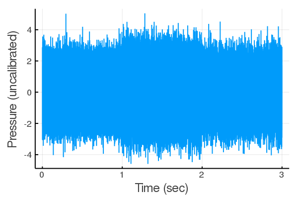
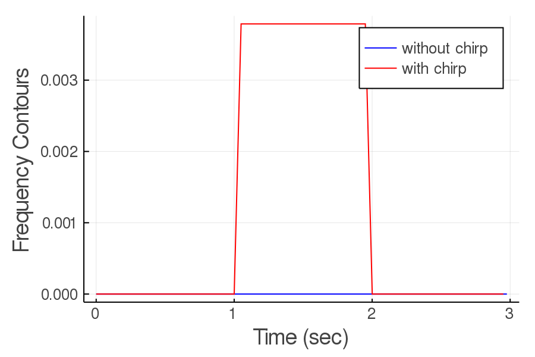

# AcousticFeatures
[](https://travis-ci.org/ymtoo/AcousticFeatures.jl)
[](https://codecov.io/gh/ymtoo/AcousticFeatures.jl)

This package implements a set of generic acoustic features for time series acoustic data.

The acoustic features are:
- Energy
- Myriad
- Vector Myriad
- Frequency Contours
- Sound Pressure Level
- Impulse Statistics (number of impulses, mean and variance of inter-impulse intervals)
- Alpha Stable Statistics (α and scale)

## Installation
using Pkg; pkg"add https://github.com/ymtoo/AcousticFeatures.jl.git"

## Usage
```julia
julia> using AcousticFeatures, Plots

julia> N=100_000; fs=100_000

julia> v = randn(Float64, 3*N)

julia> s = chirp(10_000, 30_000, 1.0, fs)

julia> x=copy(v); x[N:2*N-1]+=s

julia> plot((1:3*N)/fs, x, xlabel="Time (sec)", ylabel="Pressure (uncalibrated)", legend=false, thickness_scaling=1.5, dpi=150)
```

```julia
julia>n=512; tnorm=1.0; fd=1000.0; minhprc = 99.0; minfdist=1000.0; mintlen=0.05; winlen=10_000; noverlap=5_000

julia> sc1 = Score(FrequencyContours(fs, n, tnorm, fd, minhprc, minfdist, mintlen), v, winlen=winlen, noverlap=noverlap)

julia> sc2 = Score(FrequencyContours(fs, n, tnorm, fd, minhprc, minfdist, mintlen), x, winlen=winlen, noverlap=noverlap)

julia> plot(sc1.indices/fs, sc1.s, xlabel="Time (sec)", ylabel="Frequency Contours", label="without chirp", color=:blue, thickness_scaling=1.5, dpi=150)

julia> plot!(sc2.indices/fs, sc2.s, xlabel="Time (sec)", ylabel="Frequency Contours", label="with chirp", color=:red, thickness_scaling=1.5, dpi=150)
```

