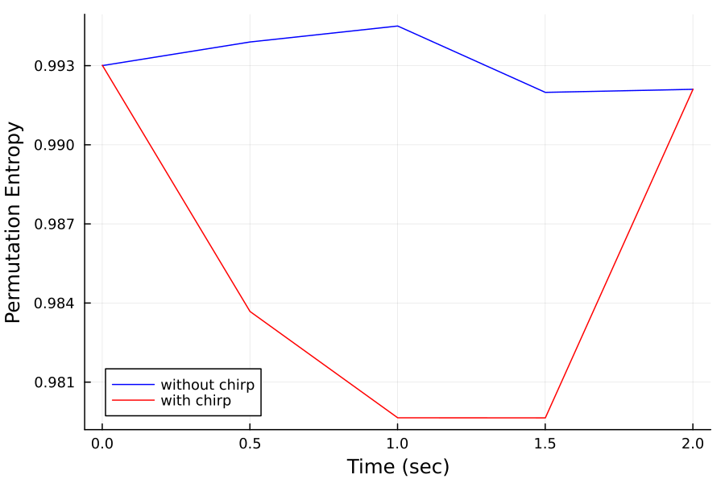
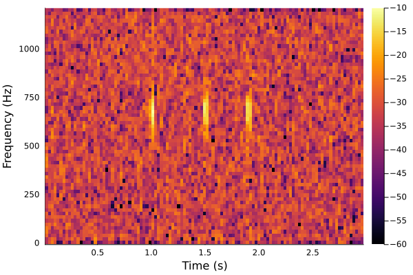

# AcousticFeatures

[](https://codecov.io/gh/ymtoo/AcousticFeatures.jl)
[](https://ymtoo.github.io/AcousticFeatures.jl/dev)

This package implements a set of methods to compute generic acoustic features in [AxisArrays](https://github.com/JuliaArrays/AxisArrays.jl.git) for time-series acoustic data.

The acoustic features are:
- Energy
- [Myriad](https://link.springer.com/article/10.1155/S1110865702000483)
- [Frequency Contours](https://asa.scitation.org/doi/10.1121/1.3531926)
- [Sound Pressure Level](https://en.wikipedia.org/wiki/Sound_pressure#Sound_pressure_level)
- Impulse Statistics (number of impulses, mean and variance of inter-impulse intervals)
- [Alpha Stable Statistics (α and scale)](https://en.wikipedia.org/wiki/Stable_distribution)
- [Entropy (temporal entropy, spectral entropy and entropy index)](https://journals.plos.org/plosone/article?id=10.1371/journal.pone.0004065)
- [Zero Crossing Rate](https://en.wikipedia.org/wiki/Zero-crossing_rate)
- [Spectral Centroid](https://en.wikipedia.org/wiki/Spectral_centroid)
- [Spectral Flatness](https://en.wikipedia.org/wiki/Spectral_flatness)
- [Permutation Entropy](http://materias.df.uba.ar/mta2019v/files/2019/06/permutation_entropy1.pdf)
- [PSD](https://en.wikipedia.org/wiki/Spectral_density)
- [Acoustic Complexity Index](https://www.sciencedirect.com/science/article/abs/pii/S1470160X10002037)
- [Statistical Complexity](https://arxiv.org/abs/nlin/0205033)
- [Acoustic Diversity Index](https://link.springer.com/article/10.1007/s10980-011-9636-9)

## Installation
```julia
using Pkg; pkg"add https://github.com/ymtoo/AcousticFeatures.jl.git"
```

## Usage
```julia
using AcousticFeatures, DSP, SignalAnalysis, Plots

function compare(sc1, sc2)
    plot(sc1.axes[1] ./ fs, vec(sc1.data),
         xlabel = "Time (sec)",
         ylabel = "Permutation Entropy",
         label  = "without chirp",
         color  = :blue,
         dpi    = 150,
         thickness_scaling = 1.0,
         legend=:bottomleft
    )
    plot!(sc2.axes[1] ./ fs, vec(sc2.data),
          xlabel = "Time (sec)",
          ylabel = "Permutation Entropy",
          label  = "with chirp",
          color  = :red,
          dpi    = 150,
          thickness_scaling = 1.0,
          legend=:bottomleft
    )
end

N  = 2400
fs = 2400
v  = randn(Float64, 3*N)
s  = real(chirp(500, 1000, 1.0, fs))
x  = copy(v); 
x[N:2*N-1] += s

specgram(signal(x,fs); fs=fs,nfft=128)
```

```julia
winlen = 2400
noverlap = 1200
pe = PermutationEntropy(5, 1, true, true)
sc1 = Score(
    pe,
    v;
    winlen = winlen,
    noverlap = noverlap
)
sc2 = Score(
    pe,
    x;
    winlen = winlen,
    noverlap = noverlap
)
compare(sc1, sc2)
```

```julia
N  = 2400
fs = 2400
v  = randn(Float64, 3*N)
Ns = fs ÷ 100
bpf = fir(13, 500, 1000; fs=fs) 
s  = 10 .* filtfilt(bpf, randn(Float64, Ns)) #real(chirp(500, 1100, 0.1, fs))
x  = copy(v); 
Ngap = fs ÷ 10
x[N:N+Ns-1] += s
x[N+5Ngap:N+5Ngap+Ns-1] += s
x[N+9Ngap:N+9Ngap+Ns-1] += s

specgram(signal(x,fs); nfft=128, fs=fs)
```

```julia
winlen = 2400
noverlap = 1200
pe = PermutationEntropy(5, 1, true, true)
sc1 = Score(
    pe,
    v;
    winlen = winlen,
    noverlap = noverlap,
)
sc2 = Score(
    pe,
    x;
    winlen = winlen,
    noverlap = noverlap,
)
compare(sc1, sc2)
```
